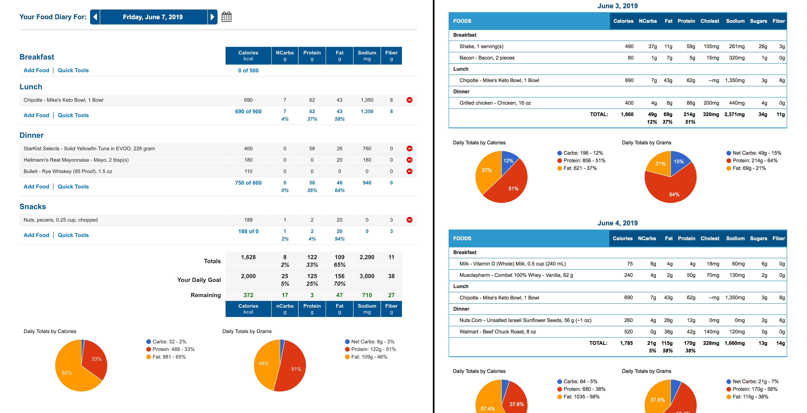

#  MyKetoPal

Optimze MyFitnessPal for a Keto diet.

Improves the diary and printable diary pages:

 - Replaces calories with net calories
 - Adds macro calorie percentages using 4-4-9
 - Adds macro graphs

-----

-----

## Setup

### Browser Plugins
Requires one of the following browser plugins:
  - [Tampermonkey](https://www.tampermonkey.net/)
  - [Greasemonkey](https://addons.mozilla.org/en-US/firefox/addon/greasemonkey/)
  - [Violentmonkey](https://violentmonkey.github.io/)

### Tracked Nutrients
Requires Carbohydrates, Protein, Fat, and Fiber to be selected as tracked nutrients in your MyFitnessPal settings.

1. Click [here](https://www.myfitnesspal.com/account/diary_settings) or go to MyFitnessPal -> Settings -> Diary Settings
2. Choose Carbohydrates, Protein, Fat, and Fiber as tracked nutrients.

## Install

Click here to install: [myKetoPal.user.js](https://github.com/yo1dog/myketopal/raw/master/myKetoPal.user.js)

## Errors

Seeing question marks? Make sure the 4 requred nutrients are tracked in your MyFitnessPal settings. See **Tracked Nutrients** section for details.

Please [create an issue](https://github.com/yo1dog/myketopal/issues) for other errors.
